# 3D Reconstruction

## Sparse reconstruction

### Implement the eight point algorithm

Recovered F (`format long`):
```
F =

   0.000000001751832  -0.000000018667432  -0.000008520163812
  -0.000000064567140  -0.000000000402138   0.000495676907212
   0.000016635390742  -0.000476097927042  -0.002056932309025
```

| Visualization of some epipolar lines |
|-----------------------------------------|
| 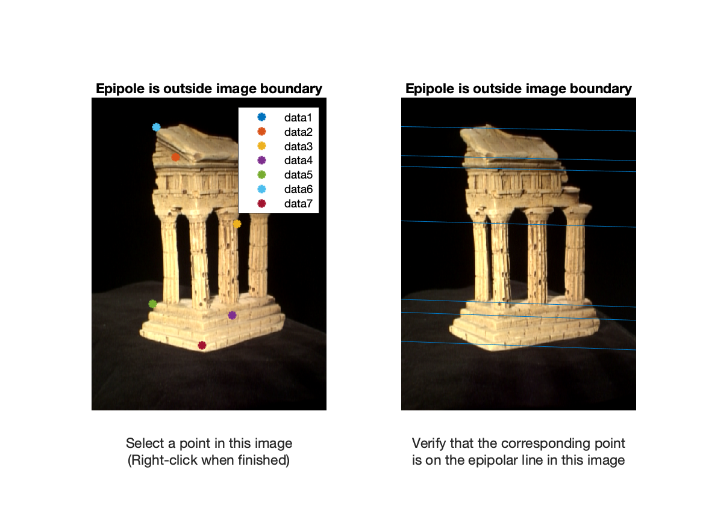 |


<br />

### Find epipolar correspondences


Similarity Metric: Euclidean distance
```
e.g. dist = sqrt(sum((window1(:) - window2(:)) .^ 2));
```

| A screenshot of epipolarMatchGui |
|-----------------------------------------|
| 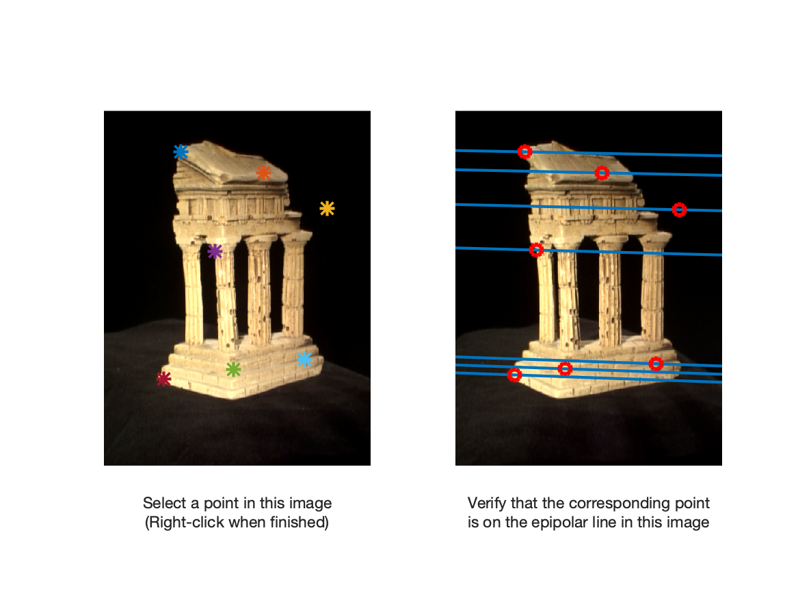 |

Caese where the matching algorithm consistently fails and why
1. If repeated patterns exist in the pictures, the algorithm fails. This happens because the repeated pattern are very likely to have similar distance score, thus the algorithm cannot tell them apart effectively.
2. If there are textureless regions in the pictures, such as pure coloring, the algorithm may fail. This happens because there id very limitied information about points in such particular area to distinguish each pixel - thus they will be largely be similar and fail to be matched.

### Write a function to compute the essential matrix

Estimated E matrix for the temple image pairs (`format long`):

```
E =

   0.004049562441320  -0.043308037276766  -0.019155487499627
  -0.149794366553690  -0.000936326071205   0.726416434975655
   0.001862968552979  -0.735240786278820  -0.000846576656318
```

### Implement triangulation

<strong>How to determine which extrinsic matrices is correct?</strong>

I used positive depth test to determine the optimal extrinsic matrix. From the 4 projection matrix candidates for camera2 from the essential matrix, I triangulate 3D points base on each of them, and use 3D points multiple by the projection matrix. If the outcome is positive, then increment the current positive depth by 1. After iterating each matrix, the votes of these four candidates are `0 288 99 189 2`, thus I choose the extrinsic matrix with the highest vote, where most of the 3D points are in front of both cameras.


```
Re-projection error using pts1, pts2 from someCorresp.mat: 0.5609
```

### Write a test script that uses templeCoords

| Angle 1 | Angle 2 |  Angle 3 | 
|-----------------------------------|-----------------------------------------|-----------------------------------------|
|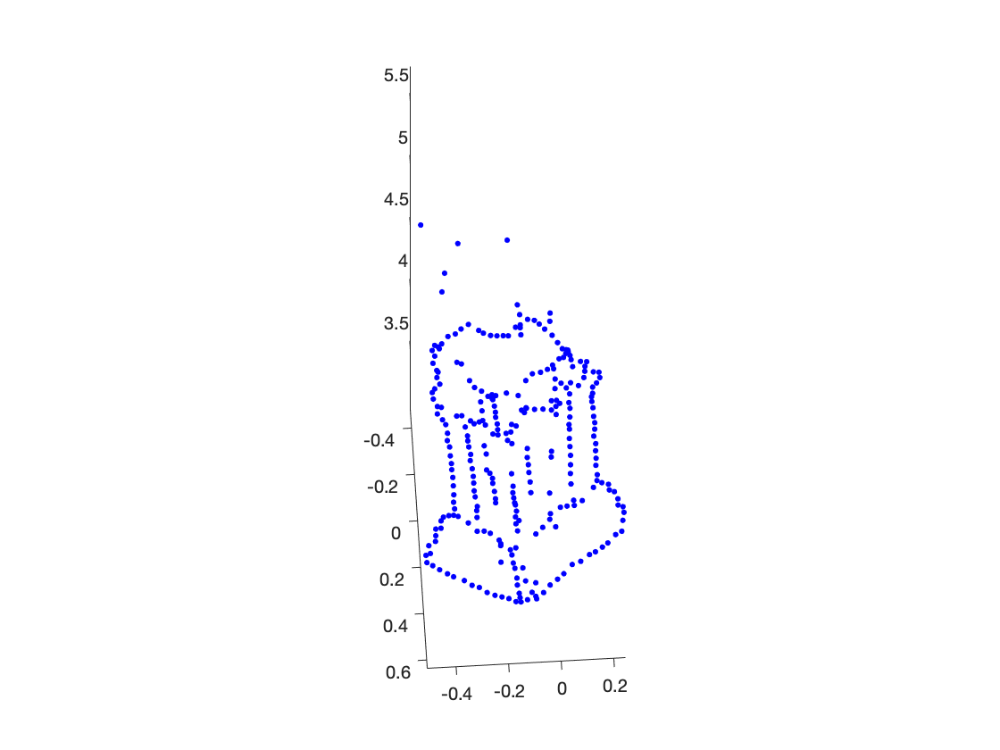|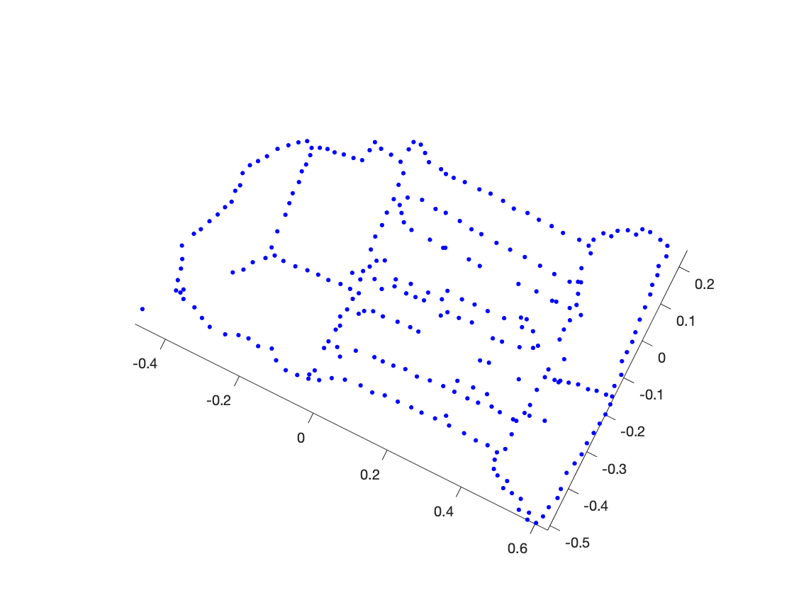|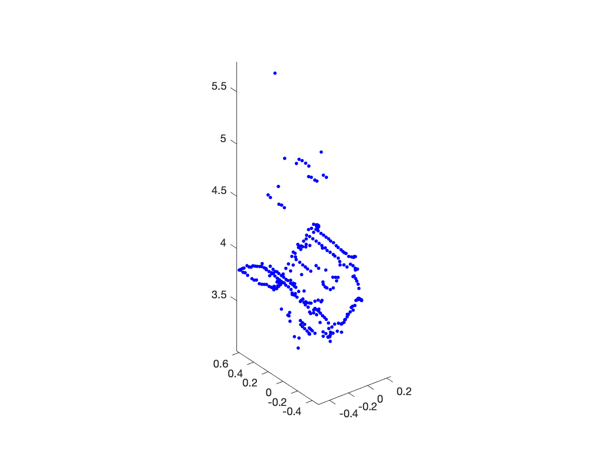|

## Dense reconstruction

### Image rectification 

| A screenshot of `testRectify.m` |
|-----------------------------------------|
| 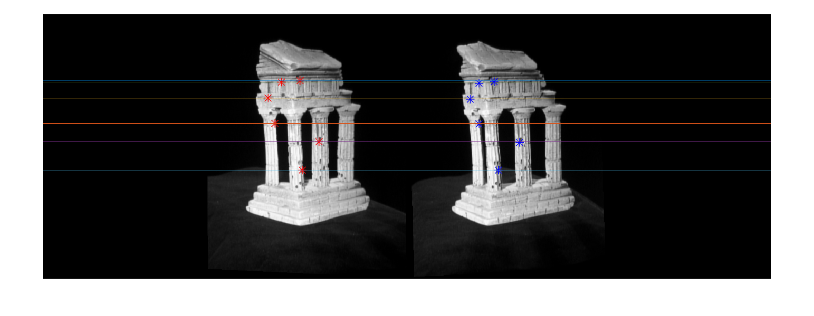 |

<br />
<br />
<br />
<br />
<br />
<br />

### Disparity map and depth map
| Disparity Map | Depth map|
|-----------------------------------|-----------------------------------------|
|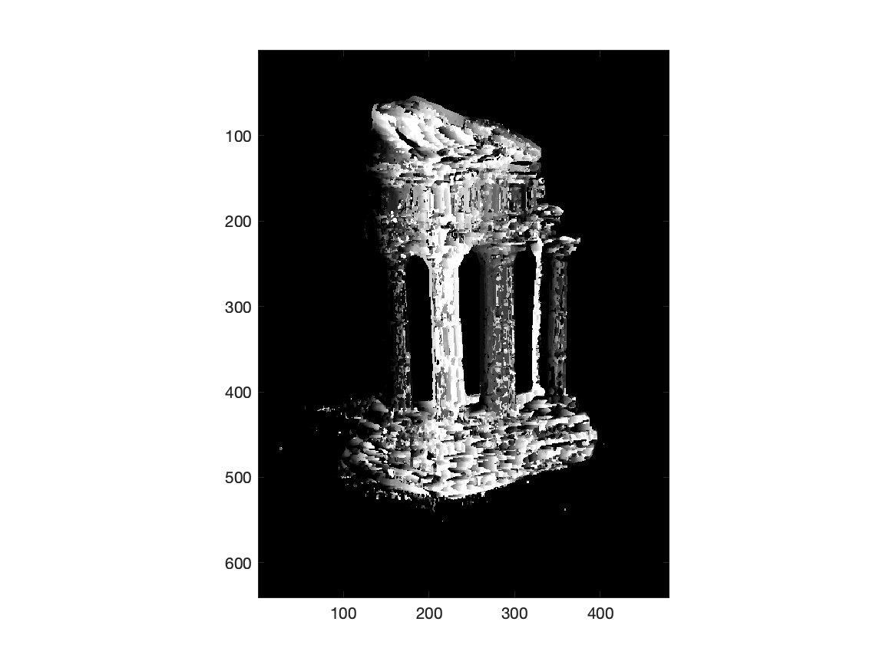|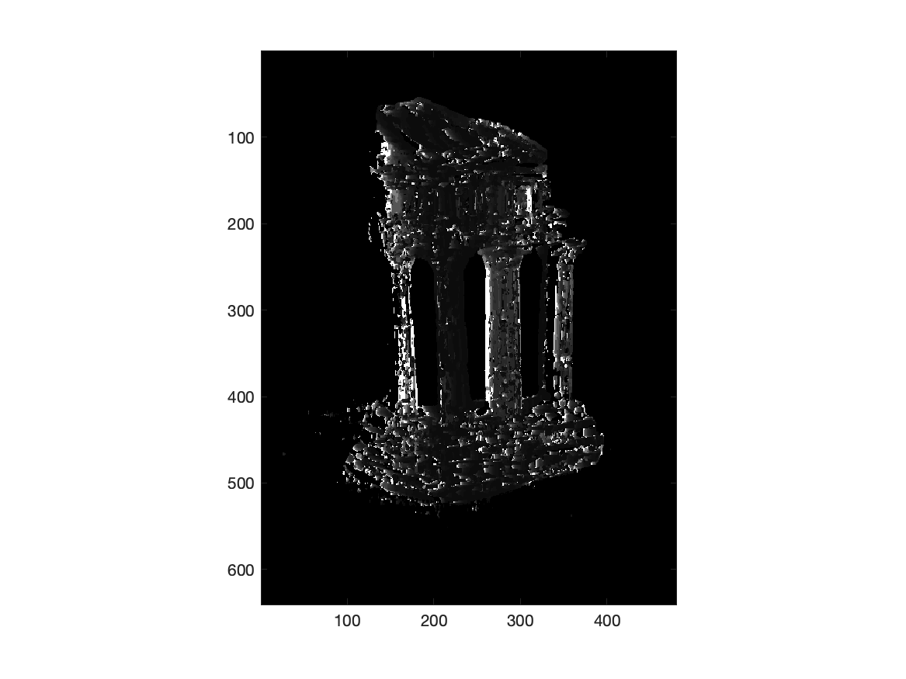|

<br />
<br />

### Pose estimation and Estimate camera matrix P 

Output of the script `testPose.m`:
```
Reprojected Error with clean 2D points is 0.0000
Pose Error with clean 2D points is 0.0000
------------------------------
Reprojected Error with noisy 2D points is 1.6602
Pose Error with noisy 2D points is 0.0227
```
<br />
<br />

### Estimate intrinsic/extrinsic parameters
Output of the script `testKRt.m`:

```
Intrinsic Error with clean 2D points is 0.0000
Rotation Error with clean 2D points is 0.0000
Translation Error with clean 2D points is 0.0000
------------------------------
Intrinsic Error with clean 2D points is 0.8572
Rotation Error with clean 2D points is 0.1146
Translation Error with clean 2D points is 0.3534
```

<br />
<br />
<br />
<br />
<br />
<br />

### Project a CAD model to the image

Figure: Project a CAD model back onto the image. 

| Image annotated with given 2D points (black circle) and projected 3D points (blue points)| CAD model rotated by estimated R | Image overlapping with projected CAD model | 
|-----------------------------------|-----------------------------------------|-----------------------------------------|
|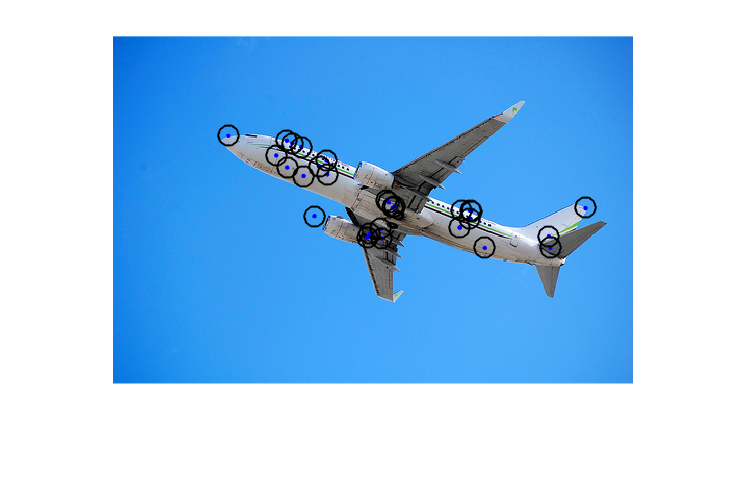|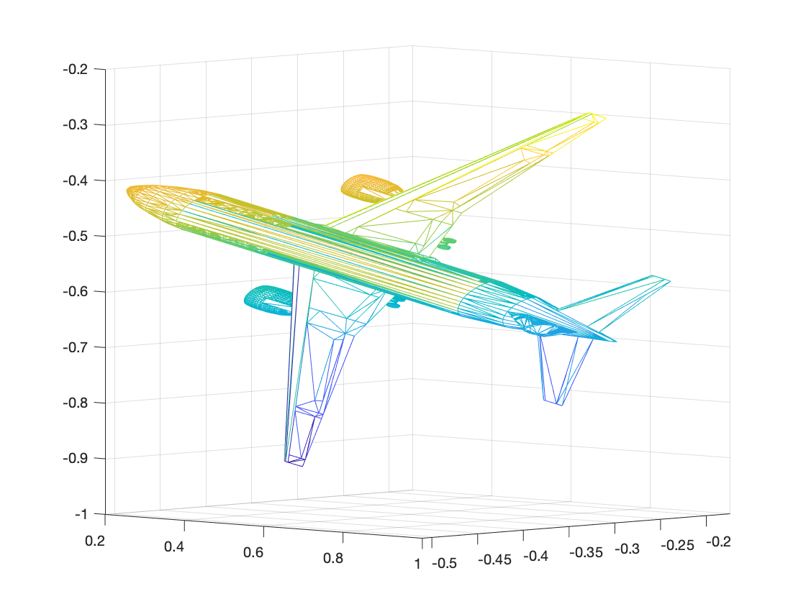|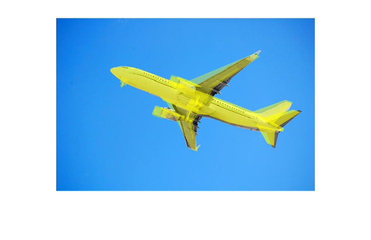|
