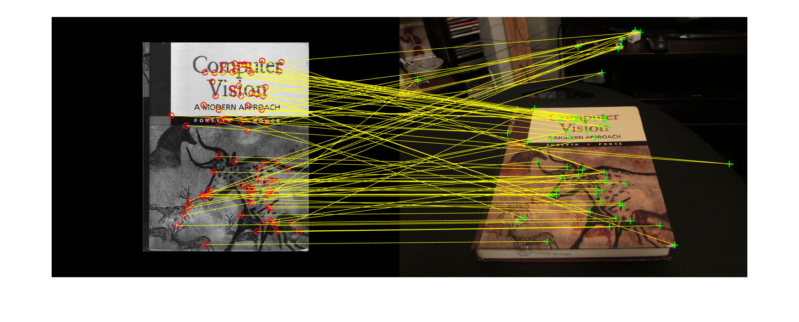
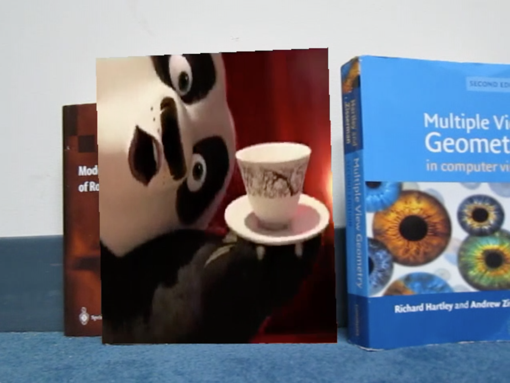

# Augmented Reality with Planar Homographies


> In this project, you will be implementing an AR application step by step using planar homographies. Before we step into the implementation, we will walk you through the theory of planar homographies. In the programming section, you will first learn to find point correspondences between two images and use these to estimate the homography between them. Using this homography you will then warp images and finally implement your own AR application.

## Feature Detection, Description, and Matching

> Before finding the homography between an image pair, we need to find corresponding point pairs between two images. But how do we get these points? One way is to select them manually (using cpselect), which is tedious and inefficient. The CV way is to find interest points in the image pair and automatically match them.

Calculated with the Matlab built-in function ​`detectFASTFeatures`​ to compute the features and `BRIEF` descriptor.

| `THRESHOLD = 10.0; MAXRATIO = 0.6;`|`THRESHOLD = 14.0; MAXRATIO = 0.68;` |
|-----------------------------------|-----------------------------------------|
|||

| `THRESHOLD = 6.0; MAXRATIO = 0.68;`|`THRESHOLD = 10.0; MAXRATIO = 0.9;` |
|-----------------------------------|-----------------------------------------|
|||

| `THRESHOLD = 10.0; MAXRATIO = 0.68;` (chosen parameters for later operations)|
|-----------------------------------|
||


## BRIEF and Rotations 


| `BRIEF, orientation: 10 degree`| `BRIEF, orientation: 50 degree`|
|-----------------------------------|-----------------------------------------|
|||

| `BRIEF, orientation: 90 degree`| `BRIEF, orientation: 180 degree`|
|-----------------------------------|-----------------------------------------|
|||


| `SURF, orientation: 10 degree`| `SURF, orientation: 50 degree`|
|-----------------------------------|-----------------------------------------|
|||

| `SURF, orientation: 90 degree`| `SURF, orientation: 180 degree`|
|-----------------------------------|-----------------------------------------|
|||


| `BRIEF, Histogram`| `SURF, Histogram`|
|-----------------------------------|-----------------------------------------|
|||

### Does the plot change significantly?
Yes, BRIEF and SURF's plot look very different. 

Firstly, the key advantage of FAST is its high-speed performance, but it doesn't compute the orientation or multiscale features. Brief compute intensity difference as a binary string, in order to represent an object. Brief inherently doesn't take account of orientation. Thus, the combination of FAST and BRIEF is still <strong>rotation variant</strong>, and will perform poorly if there's an in-plane rotation.

Comparably, SURF is <strong>rotation invariant</strong> by keeping track of a reproducible rotation for the interest points with the Haar-wavelet responses. Thus, whiling rotating the image, featurs can still be tracked.

## Homography Computation

> A planar homography is a warp operation (which is a mapping from pixel coordinates from one camera frame to another) that makes a fundamental assumption of the points lying on a plane in the real world. Under this particular assumption, pixel coordinates in one view of the points on the plane can be directly mapped to pixel coordinates in another camera view of the same points.

Picked a certain number of points (10 points) from the first image, and show the corresponding locations in the second image after the homography transformation.

| Homography (without Normalization) |
|-----------------------------------------|
|  |


| Homography (with Normalization) |
|-----------------------------------------|
|  |

#### Homography RANSAC

```
THRESHOLD = 3; % based on experiments
```

| visualize the optimal 4 point-pairs |
|-----------------------------------------|
|  |


| Inlier matches (10 points) selected by RANSAC|
|-----------------------------------------|
|  |

## HarryPotterizing a Book 

| HarryPotterizing CV Book |
|-----------------------------------------|
| |

## Creating your Augmented Reality application 

AR source video was center cropped to a similar ratio with the book cover image. Video can be find `results/ar_movie.avi.mp4`.

| AR video sample frame|
|-----------------------------------------|
| |
