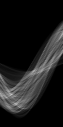

# Image Filtering and Hough Transform

## Convolution

### Visualize test image 1 with two different kernels 

| Blur Filter (Box kernel) `kernel = ones(15)`| Sharping Filter   `kernel = [0 -1 0; -1 5 -1; 0 -1 0]` |
|-----------------------------------|-----------------------------------------|
|||

## Edge detection 

### Visualize `myEdgeFilter` results on test image 1&2 edges and edges after threshold

|           | Image 1                                             | Image 2                                             |
|-----------|-----------------------------------------------------|-----------------------------------------------------|
| Edge      | |            |
| Threshold |   | |

## Hough Transform

### Visualize `myHoughTransform` results on test image 1&2 hough accumulator

| Image 1                                 | Image 2                                 |
|-----------------------------------------|-----------------------------------------|
|  |  |


## Finding lines
Here, non maximal suppression was enabled with matlab function `imregionalmax`, it returns the binary image that identifies the regional maxima in the input image. I use `H = imregionalmax(H).* H` to then zero out the non-regional maxima which considers all neighbors. 

### Visualize test image 1&3 result of peak finding 

| Image 1                                 | Image 3                                 |
|-----------------------------------------|-----------------------------------------|
|  |  |


## Fitting line segments for visualization

### Visualize test image 1&2 line segment extraction results

| Image 1                                 | Image 2                                 |
|-----------------------------------------|-----------------------------------------|
| | |


## Experiments

### Summary

1. Did your code work well on all the images with a single set of parameters?

With one set of parameters, all the images give satisfactory results, though they are not optimal. With customized set of parameters, the performance could visibly be improved.

2. How did the optimal set of parameters vary with images? 

I find that, with more details (lines, unregular shapes, and etc.), `threshold` can be set higher, for example `0.1` to rule out fuzzy and unbounded area so that the edges look neat and clean. It also helps to set `thetaRes` lower, for example `pi/120` to sample more `theta` values in the range. `Sigma = 4` seems to be blur the images well for all cases, though slightly increasing sigma for images with more details can also help to get a clean result. Setting `rhoRes` to a higher value breaks the hough line segments into smaller intervals and can help to capture short and less obvious boundaries of objects, though the results seems busy due to the small line segments all over the image. 

3. Which step of the algorithm causes the most problems? 

I think `myEdgeFilter` caused the most problems, it's mainly because the implementation of non maximum suppression requires complex conditions.

4. Did you find any changes you could make to your code or algorithm that improved performance? 

I recognize that vectorization in Matlab often runs more efficiently than the loops. In particular, in `myHoughLines.m`, I used a loop to iterate (from 1 to nLines) and fill rhos and thetas, though in hindsight, I could use `ind2sub` vectorized code in Matlab to convert linear indices to subscripts.

### A set of intermediate outputs for test image 4

| Original                                  | Gaussian Blurred                            | Sobel Filter                              | Normalized Sobel Filter                     |
|-------------------------------------------|---------------------------------------------|-------------------------------------------|---------------------------------------------|
|||  ||
| Edge                                      | Threshold                                   | Hough Accumulator                         | Hough Lines Extraction                      |
| | | | |

### More Results on new test images

Vancouver

```
sigma     = 5;
threshold = 0.1;
rhoRes    = 10;
thetaRes  = pi/90;
nLines    = 45;
```

| Original                                    | Edge                                     |Threshold |  Hough Accumulator         | Hough Lines Extraction                   |
|---------------------------------------------|------------------------------------------|---------------------------------------------|------------------------------------------|------------------------------------------|
|         | |  |  |  |

Mona Lisa

```
Parameters
sigma     = 2;
threshold = 0.2;
rhoRes    = 8;
thetaRes  = pi/60;
nLines    = 80;
```

| Original                                    | Edge                                     |Threshold |  Hough Accumulator         | Hough Lines Extraction                   |
|---------------------------------------------|------------------------------------------|---------------------------------------------|------------------------------------------|------------------------------------------|
|         | |  |  |  |

Pikachu, Kumamoto
```
sigma     = 4;
threshold = 0.03;
rhoRes    = 4;
thetaRes  = pi/90;
nLines    = 30;
```

Pikachu

| Original                                    | Edge                                     |Threshold |  Hough Accumulator         | Hough Lines Extraction                   |
|---------------------------------------------|------------------------------------------|---------------------------------------------|------------------------------------------|------------------------------------------|
|         | |  |  |  |

Kumamoto

| Original                                    | Edge                                     |Threshold |  Hough Accumulator         | Hough Lines Extraction                   |
|---------------------------------------------|------------------------------------------|---------------------------------------------|------------------------------------------|------------------------------------------|
|         | |  |  |  |
