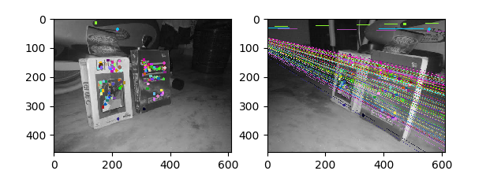

# Computer Vision Algorithms 

### Content
| # | Name                                  | Description                                                 | Teaser                |
|---|---------------------------------------|-------------------------------------------------------------|-----------------------|
| 1 | [Active Contours](Active%20Contours)   | Edge detection                                              |   |
| 2 | [Poisson Blending](PoissonBlending) | Blend source image and target image seamlessly              |  |
| 3 | [Reconstruction](Reconstruction)     | Adjusting the brightness of an image through reconstruction |    |
| 4 | [Coons Patch](Coons%20Patch)     | A smooth surface initialized by 4 points |    |
| 5 | [8Point/RANSAC](RANSAC)     | Estimate the fundamental matrix based on 8 point or RANSAC algorithms  |    |
| 6 | [Image Filtering/Hough Transform](Hough%20Transform)     | Generate edge and detect line segments from an image  |    |