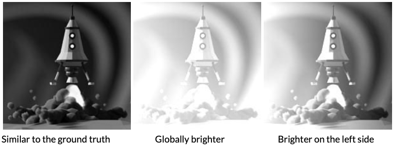

# Computer Vision Algorithms 

### Content
| # | Name                                  | Description                                                 | Teaser                |
|---|---------------------------------------|-------------------------------------------------------------|-----------------------|
| 1 | [Active Contours](Active%20Contours)   | Edge detection                                              |   |
| 2 | [Poisson Blending](PoissonBlending) | Blend source image and target image seamlessly              |  |
| 3 | [Reconstruction](Reconstruction)     | Adjusting the brightness of an image through reconstruction |    |
