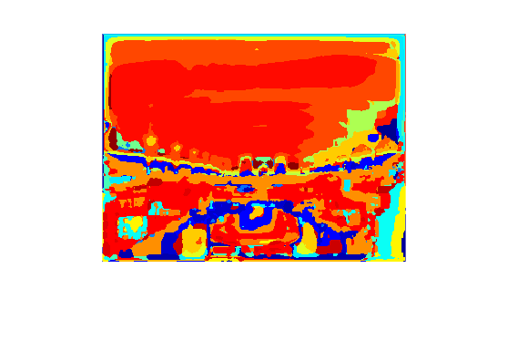
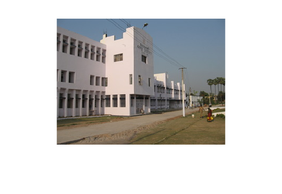

# Scene Recognition with Bag of Words

## Part 1: Build Visual Words Dictionary
### Extract Filter Responses

##### Show an image from the data set and 3 of its filter responses.

| ||
|-----------------------------------|-----------------------------------------|
|||

##### Explain any artifacts you may notice. 

Other than the obvious blurring artifacts in the results, the boundary of filter 2 are darkened, this may be due to the handling of edges in calculating the derivatives. 

##### Briefly describe the CIE Lab color space, and why we would like to use it. 

In CIE Lab color space, L* stands for Lightness, a* is Red/Green Value, and b* represents Blue/Yellow Value. CIE was designed that numerical change in its values are reflected roughly by the same amount of visually perceived change. Thus, in a way, we would like to use it because it reflects and approximate human perceptual vision, while RGB or CMYK depends on modeling of physical devices rather than human vision. CIE are utilized by modifying color curves in a and b components, and adjusting brightness contrast with the L component. 

### Collect sample of points from image
##### Show the results of your corner detector on 3 different images.

| ||
|-----------------------------------|-----------------------------------------|
| ||
| ||

## Part 2: Build Visual Scene Recognition System
### Convert image to word map

##### Show the word maps for 3 different images from two different classes (6 images total). Do this for each of the two dictionary types (random and Harris). 

| auditorium | harris dictionary | random dictionary |
|-----------------------------------|-----------------------------------------|-----------------------------------------|
| |||
| |||

| airport | harris dictionary | random dictionary |
|-----------------------------------|-----------------------------------------|-----------------------------------------|
| |||
| |||

| campus | harris dictionary | random dictionary |
|-----------------------------------|-----------------------------------------|-----------------------------------------|
| |||
| |||

##### Are the visual words capturing semantic meanings? 
Yes, from the images above, I think the visual words does capture some semantic meanings. In both dictionary, different color draw boundaries of segments in the image. For example, in the campus images above, the building is colored differently than sky, grass, and people in front of the building. Additionally, some details have also been captured, such as the windows and textures on the building. 

##### Which dictionary seems to be better in your opinion? Why?
Harris appears to be better in my opinion. From the images above, harris dictionary gives a clear boundary of segments classification with visually less crowded results. Random dictionary gives a noisy results with mostly rounded boundaries.

I think this makes senses because Harris dictionary was captured based on the harris corners of the objects, so naturally it should perform better in representing such features. Compared to the random dictionary where points are random sampled, Harris dictionary will have an edge in classifying features in the image.

## Part 3: Evaluate Visual Scene Recognition System
### Evaluate Recognition System - NN and kNN

##### Include the output of evaluateRecognitionSystem_NN.m (4 confusion matrices and accuracies).
```
random & euclidean result:
confusion:
    14     3     1     1     0     0     0     1
     4    12     2     0     1     1     0     0
     5     4     7     1     1     1     1     0
     2     2     0     8     2     0     4     2
     1     3     1     3     7     0     4     1
     3     4     2     4     0     3     1     3
     3     0     1     7     1     0     7     1
     5     0     0     4     0     0     0    11

accuracy:
    0.4313

random & chi2 result:
confusion:
    14     2     2     0     0     0     0     2
     3    12     3     0     1     1     0     0
     2     5    13     0     0     0     0     0
     0     2     2     6     1     3     4     2
     0     4     3     2     9     0     2     0
     2     2     3     0     2     8     2     1
     2     1     3     5     1     0     5     3
     4     0     0     3     0     0     0    13

accuracy:
    0.5000

harris & euclidean result:
confusion:
    10     3     3     2     1     0     0     1
     5    12     1     0     2     0     0     0
     9     2     7     1     1     0     0     0
     1     3     1     7     0     1     5     2
     1     1     3     1     8     0     6     0
     1     4     2     5     0     4     2     2
     1     1     0     6     2     2     7     1
     2     0     1     2     0     0     0    15

accuracy:
    0.4375

harris & chi2 result:
confusion:
    13     1     3     0     0     0     0     3
     6    11     0     0     1     1     1     0
     5     2     9     0     3     0     1     0
     1     2     2     7     0     1     6     1
     1     2     2     0    12     0     3     0
     0     4     3     2     0     7     1     3
     1     0     2     3     2     1     9     2
     4     0     0     1     0     0     0    15

accuracy:
    0.5188
```

##### How do the performances of the two dictionaries compare? Is this surprising?

From the results above, Harris dictionary works better than random dictionary. This is not surprising because of the reason mentioned above - harris dictionary capture corners, which already carries semantic meaning within itself, while random dictionary are sampled randomly and doesn't carry any prior knowledge of the images.

##### How about the two distance metrics? Which performed better? Why do you think this is?
From the results above, Chi2 distance works better than euclidean distance metrics. I think this is due to Chi2 (used to compare histograms) has built-in nonlinearity and thus can capture meaning in high dimensional data.

Plus, euclidean distance doesn't work well for high dimensional data in general, say if the points distribution are uniformly spaced from each other, the euclidean distance doens't capture much meaning.

##### Also include output of evaluateRecognionSystem kNN.m (plot and confusion matrix). 
Following the answers above, I did my experiments on harris dictionary and distance metrics to get the best possible results from kNN. 


##### Comment on the best value of k. Is larger k always better? Why or why not? How did you choose to resolve ties?

```
optimal k = 32
accuracy
    0.5750

confusion
    14     3     2     0     0     0     0     1
     4    14     1     0     0     0     1     0
     4     4    12     0     0     0     0     0
     2     3     0    10     0     0     4     1
     0     4     3     0    11     0     2     0
     3     3     3     4     0     4     2     1
     4     0     1     2     4     0     9     0
     1     1     0     0     0     0     0    18
```

From the accuracy plot above, increase k doens't always improve the performance of kNN, however carefully fine-tuning a larger k can probably tolerate more noise and achieve better than average results. My optimal k is 32, where the  accuracy hits 57.5%.

## Part 4: Advanced techniques
### Evaluate Recognition System - Support Vector Machine
##### Are the performances of the SVMs better than nearest neighbor? Why or why not? Does one kernel work better than the other? Why?

From my experiments with `linear`/`gaussian`/`polynomial` SVM along with Harris and Random dictionaries, SVMs with `polynomial` kernel perform about the same as kNN, but `linear`/`gaussian` kernel are worse than kNN. I think that's because our high dimensional image dataset cannot be easily separable using the linear or gaussian decision planes, but polynomial model can better carry the information in the dataset.

Moreover, I did experiment on kNN with random points, and it seems SVMs in this case can perform better than kNN, with any of `linear`/`gaussian`/`polynomial` kernel. Thus kNN's performace needs to reply on good features extraction prior to the nearest neighbor algorithm.

```
Harris:

SVM & linear:
accuracy:
    0.4250

confusion:
    12     5     2     0     0     0     0     1
     5    14     0     0     0     0     1     0
     4     5    10     0     1     0     0     0
     3     1     1     5     0     0    10     0
     0     5     3     0     5     0     7     0
     7     2     3     3     0     0     4     1
     5     0     2     0     4     0     9     0
     5     1     0     1     0     0     0    13

SVM & gaussian:
accuracy:
    0.4875

confusion:
    12     5     2     0     0     0     0     1
     5    13     0     0     1     0     1     0
     3     5    12     0     0     0     0     0
     2     1     1     9     0     0     7     0
     0     4     3     0     6     0     7     0
     3     2     3     5     0     3     3     1
     3     0     1     2     5     0     9     0
     4     1     0     1     0     0     0    14

SVM & polynomial:
accuracy:
    0.5500

confusion:
    13     5     1     0     0     0     0     1
     5    13     0     0     1     0     1     0
     3     5    12     0     0     0     0     0
     2     1     1     9     0     0     7     0
     0     4     2     0     9     0     5     0
     3     2     3     3     0     5     3     1
     2     0     1     2     5     0    10     0
     2     1     0     0     0     0     0    17


Random
SVM & linear:
accuracy:
    0.4750

confusion:
    15     3     1     0     0     0     0     1
     5    13     0     0     1     0     1     0
     2     6    11     0     1     0     0     0
     1     2     1     3     0     0    13     0
     0     4     3     0     8     0     5     0
     5     3     2     2     1     1     5     1
     7     0     0     0     3     0    10     0
     3     1     0     0     0     0     1    15

SVM & gaussian:
accuracy:
    0.5312

confusion:
    15     3     1     0     0     0     0     1
     5    13     0     0     1     0     1     0
     2     7    11     0     0     0     0     0
     1     2     1     9     0     0     7     0
     0     3     3     0     9     0     5     0
     2     3     2     4     1     4     3     1
     3     0     1     2     4     0     9     1
     2     1     0     1     0     0     1    15

SVM & polynomial:
accuracy:
    0.5563

confusion:
    15     3     1     0     0     0     0     1
     4    13     0     0     2     0     1     0
     2     6    12     0     0     0     0     0
     0     2     1    10     0     0     7     0
     0     2     2     1    10     0     5     0
     3     3     2     2     1     5     3     1
     3     0     0     2     5     0     9     1
     2     1     0     1     0     0     1    15


```

### Inverse Document Frequency
##### How does Inverse Document Frequency affect the performance? Better or worse? Does this make sense?


IDF impace the performance positively, and I think it makes sense. Since document frequency measures commonness (frequency), IDF measures the opposite of that, which is uniqueness of an image. It helps identify what makes a given feature rare, thus better classification.

```
optimal k = 16
accuracy
    0.5813

confusion
    15     1     2     0     0     0     0     2
     5    13     2     0     0     0     0     0
     4     5    11     0     0     0     0     0
     2     2     2    10     0     0     3     1
     0     3     2     1    11     0     3     0
     2     3     2     3     1     7     0     2
     5     0     1     3     2     0     8     1
     1     0     1     0     0     0     0    18

```
### Better pixel features

##### What did you experiment with and how did it perform. What was the accuracy?

I would like to experiment with HOG, which is a dense feature extraction algorithm for images. It's useful due to its nonlinearity (puts orientation gradients in a bin) and it covers all location in an image sampling small sub-regions one at a time, for example 8x8 pixels cells and blocks of 2x2 cell as in the `matlab` implementation below. 

I experiment with HOG features with SVM classifiers with `linear`/`gaussian`/`polynomail` kernel functions, and `polynomial` with HOG features gives the best result - 85% accuracy. With HOG features, the accuracies were easily above 75%.

The HOG features were extracted with Matlab built-in function `extractHOGFeatures`. As explained in the , the function extract histogram of oriented gradients (HOG) features given an image. 

Here are the confusion matrices and accuracy of HOG features under SVM with three different kernel.

```
SVM & linear:
accuracy:
    0.7750

confusion:
    11     4     2     2     1     0     0     0
     1    14     3     0     0     1     1     0
     1     0    18     0     0     0     0     1
     0     0     0    15     0     0     3     2
     0     0     0     0    16     0     4     0
     0     2     0     1     1    15     1     0
     0     1     0     0     1     0    15     3
     0     0     0     0     0     0     0    20

SVM & gaussian:
accuracy:
    0.8063

confusion:
    12     4     1     2     1     0     0     0
     1    15     2     0     1     1     0     0
     0     0    19     0     0     0     0     1
     0     0     0    17     1     0     0     2
     0     0     0     0    16     0     4     0
     0     1     0     1     3    14     1     0
     0     1     0     0     0     0    16     3
     0     0     0     0     0     0     0    20

SVM & polynomial:
accuracy:
    0.8500

confusion:
    12     3     3     1     1     0     0     0
     1    16     2     0     0     0     1     0
     0     1    19     0     0     0     0     0
     0     0     0    18     1     0     0     1
     0     0     0     0    17     0     3     0
     0     1     0     1     0    18     0     0
     0     1     0     0     2     0    16     1
     0     0     0     0     0     0     0    20


```